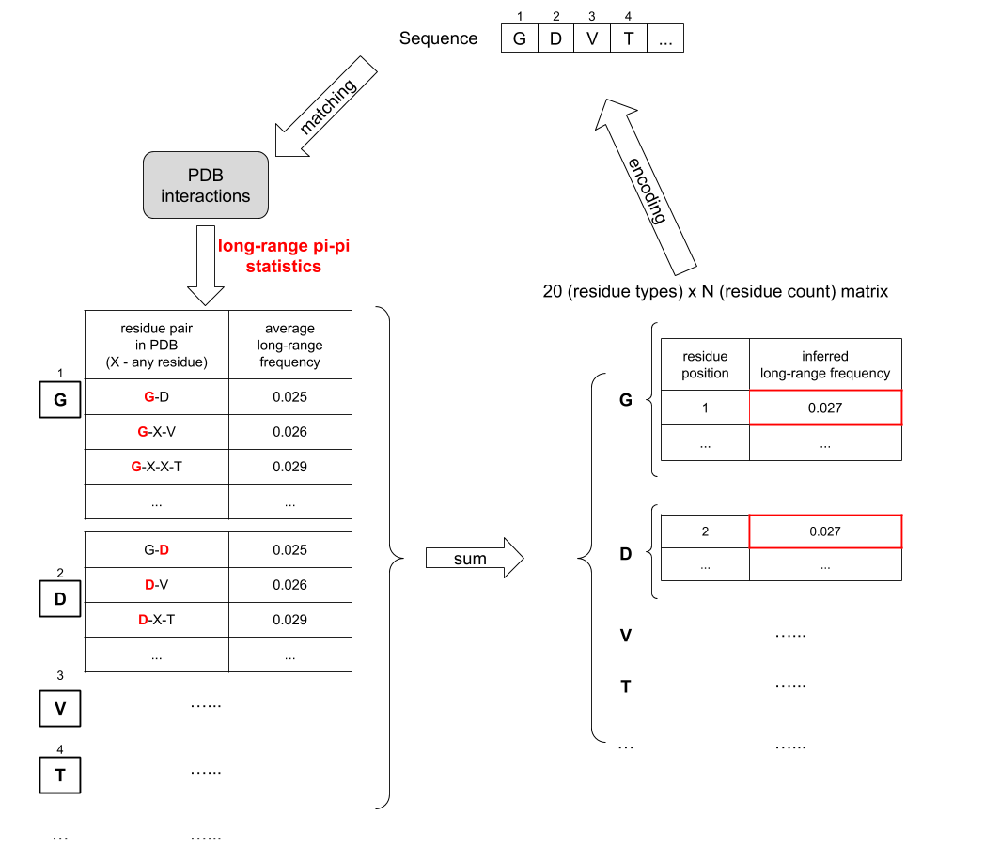

# LLPhyScore: An interpretable machine learning algorithm to predict disordered protein phase separation based on biophysical interactions

**LLPhyScore** is a bioinformatic tool for the prediction of protein phase separation. This repository contains the source code for developing this tool.

## Problem
Protein liquid-liquid phase separation (LLPS) has significant roles in many biological processes, including cellular organization, signaling, transcription, biological materials and pathological aggregation. Understanding of this property of proteins are vital to the effective treatment of many neurological diseases, such as Alzheimers's disease and Parkinson's disease. If we can predict a person's brain proteins have mutated and are prone to LLPS, we can prevent it or starting intervening at an early stage of the disease.

However, because of the complexity of sequence-structure-property for LLPS proteins, there hasn’t been a consensus so far regarding the physicochemical principles underlying LLPS. It has been found that LLPS can be driven by a wide range of weak forces in physics, including electrostatic interactions, pi-pi stacking, cation-pi interactions, hydrogen bonding, and hydrophobic effect. Therefore it is very difficult to come up with a "perfect" physical model to explain and predict protein LLPS. In addition, the majority of known LLPS proteins are intrinsically disordered proteins (IDPs), and therefore it is very difficult to use MD simulation to study LLPS.

## Solution
This tool uses machine learning methods draw biophysical insights from currently known (~500) LLPS sequences. I first developed and trained a sequence embedding system that provides interpretation of the driving forces of LLPS. Then, I trained a supervised classification model on the biophysical embedding on training samples. The predictive model achieved a high accuracy (92%) on the test set, while providing sufficient biological insights for web lab experiments at the same time.

## Installation
Follow these steps to install LLPhyScore:  
**Step 1**: Make sure you have Python3 in your computer.
- How to check and/or install Python3 version - https://realpython.com/installing-python/
- Official Python website - https://www.python.org/
  
**Step 2**: A Python3 environment with pre-installed libraries (numpy, scipy, pandas, tqdm, scikit-learn) is required to run LLPhyScore in your machine. If you don't want to change your default Python3 environment, please do the following to create a virtual environment:  
- Make sure you have pip3 installed in your Python3 environment; If not, install pip3 - 
https://ehmatthes.github.io/pcc/chapter_12/installing_pip.html
- In your terminal, install `virtualenv`, a tool to create isolated Python environments. (If you already have `virtualenv` installed, skip this step.)
    ```
    pip3 install virtualenv
    ```
- In your terminal, navigate to the same directory where this README file is, then create a virtual environment named "LLPhyScore_venv".  
    ```
    cd LLPhyScore/
    virtualenv LLPhyScore_venv
    ```
- Activate "LLPhyScore_venv" environment. 
    ```
    source LLPhyScore_venv/bin/activate
    ```

**Step 3**: In your preferred environment (either your default Python3 environment, or a virtual environment as set up in Step 2), use pip to install Python library dependencies.
```
pip3 install -r requirements.txt
```

**Step 4**: Clone from the official repository:  
```
git clone https://github.com/julie-forman-kay-lab/LLPhyScore.git
```

**Step 5**:  Navigate to the new LLPhyScore folder:  
```
cd LLPhyScore
```

**Step 6**: Unpack the standalone package:
```
cd standalone_package
tar -xvf LLPhyScore-standalone-20220627.tar.gz
```

## Usage
Follow these steps to use the LLPhyScore (standalone package) on example fasta file to predict the LLPS propensity of FUS:  

**Step 1**: Navigate to the standalone package folder:
```
cd standalone_package/LLPhyScore
```

**Step 2**: Run LLPhyScore on the example fasta file. You should see output scores for example sequences.
```
python3 LLPhyScore_standalone.py -i ./example.fasta
```

**Step 3**: To run LLPhyScore on your other fasta files, replace `./example.fasta` with your fasta file's path in Step 4. You can only run one file at a time.
- There are three models trained on three different negative datasets to use: (i) trained on human+PDB; (ii) trained on human proteome only; (iii) trained on PDB only. Default option is (i) human+PDB, but you can change which model to use by passing your wanted type to argument `-m`. 
    ```
    # using (human+PDB) model. (Default option)
    python3 LLPhyScore_standalone.py -i ./example.fasta -m human+PDB
    # using (human) model.
    python3 LLPhyScore_standalone.py -i ./example.fasta -m human
    # using (PDB) model.
    python3 LLPhyScore_standalone.py -i ./example.fasta -m PDB
    ```
- There are five options for sequence-level score output: (i) raw score; (ii) percentile ranking; (iii) zscore (iv) modified zscore (v) all score types. Default option is (ii) percentile ranking, but you can change output score type by passing your wanted type to argument `-s`. (All "relative" score types are calculated against human proteome.)
    ```
    # output raw score
    python3 LLPhyScore_standalone.py -i ./example.fasta -s raw
    # output percentile ranking (Default option)
    python3 LLPhyScore_standalone.py -i ./example.fasta -s percentile
    # output zscore
    python3 LLPhyScore_standalone.py -i ./example.fasta -s zscore
    # output modified zscore
    python3 LLPhyScore_standalone.py -i ./example.fasta -s modified_zscore
    # output all score types
    python3 LLPhyScore_standalone.py -i ./example.fasta -s all
    ```

- There are two extra options for residue-level score output: (i) sum-score of 100 top-scored residues in the sequence; (ii) score of each individual residue in a sequence (smoothed out over its neighboring 50 residues). You can get residue-level results by passing them to argument `-s`.
    ```
    # output sum-score of 100 top-scored residues
    python3 LLPhyScore_standalone.py -i ./example.fasta -s top100_residue_sum
    # output residue-level score
    python3 LLPhyScore_standalone.py -i ./example.fasta -s residue_level
    ```

- By default, the output scores are not saved. To save the scores in a csv file, pass the file path you want to save to argument `-o`. 
    ```
    python3 LLPhyScore_standalone.py -i ./example.fasta -o your_file_name.csv
    ```

**Step 4**: After running, exit or delete your virtual environment.
```
# exit virtual environment
deactivate

# delete virtual environment
rm -rf LLPhyScore_venv
```

## Workflow


## Modules
The `src` directory contains the Python modules for building and training of LLPhyScore.

### Loader.py
This is the module that I wrote to load input protein sequences. Each protein sequence is converted to a 'grid' representation with multiple levels as shown in this figure.
Each 'grid' is a nested python dictionary that has multiple levels.
1. In the first level, the dict keys are 8 different biophysical features; (dict values are the info stored in the next level)
2. In the second level, the dict keys are 20 different amino acid residues; (dict values are the info stored in the next level)
3. In the third level, each amino acid residue (keys in the second level) is mapped to a 3xN matrix (N can be different for different residues in different sequences). The first column of the matrix is the position index of this residue; The second column and third column is the inferred biophysical feature statistics for this residue (e.g. mean electrostatic charge for glycine) extracted from PDB.


### Model.py
This is the module with functions to construct a sequence "embedding" - by assigning a threshold ("weight") to a sequence "grid" for all biophysical feature statistics. The idea behind this design is that I found that the
distributions for theses biophysical feature statistics in PDB are mostly normal distributions, and therefore if a residue's inferred biophysical feature statistics is abnormally high or abnormally low, there is a higher possibility that they will cause abnormal phase transition behavior. So I will put a statistics threshold ("weight") for each residue in each feature, and by comparing the "grid" to the "weight" using rewarding/penalizing functions, I calculated a overall score for each feature for a given sequence. The training/optimization of the sequence "embedding" system is just the problem of finding the best threshold ("weight") such that my positive samples and negative samples in the training set have very different overall scores, which is performed in the "Trainer" module.

### Trainer.py
This is the module that I wrote to train the embedding. Each residue type's biophysical feature was initiated with a "weight" - a threshold to judge this residue's biophysical activity by. By finding the optimal threshold ("weight") for each biophysical feature such that it maximize the separation of "grid-to-weight" score between positive and negative training samples. The optimization process uses genetic algorithm and stochastic optimization; The optimized metric is ROC AUC score.

### Predictor.py
This is module where my trained ML model is encapsulated and loaded to calculate the phase separation probability of any input sequence or fasta file.

### Names.py
This is the module to store residue names, mappings of variables and biophysical feature names.

### Config.py
This is the module to store directory configurations.

### Utils.py
This is the module to store utility functions and classes.

## Dataset
The `data/raw` directory contains the raw datasets used to train LLPhyScore algorithm:  
- `TRUE_POSITIVE_SEQUENCES_UNTAGGED_20191126.fasta` contains 565 curated LLPS-positive sequences.
- `PDB.TOTALSET.fasta` contains 16794 PDB sequences collected from high-resolution (≤2.0 A) structures in PDB database.
- `uniprot_reference_human_24NOV2019.fasta` contains 20380 human proteome sequences collected from Unitprot.

The `data/processed/total` directory contains processed datasets generated from raw datasets:
- `tp_seq_tags.pkl` contains tags of 565 LLPS-positive sequences.
- `tp_seq_seqs.pkl` contains sequences of 565 LLPS-positive sequences.
- `tp_seq_groups.pkl` contains clustered groups of 565 LLPS-positive sequences, clustering on sequence similarity.
- `pdb_seq_tags.pkl` contains tags of randomly selected 3406 PDB sequences.
- `pdb_seq_seqs.pkl` contains sequences of randomly selected 3406 PDB sequences.
- `human_seq_tags.pkl` contains tags of randomly selected 3406 human sequences.
- `human_seq_seqs.pkl` contains sequences of randomly selected 3406 human sequences.

The `data/cleaned` directory contains LLPhyScore raw scores of human/PDB proteome against different models, for calculation of Z-score and percentile rankings:
- `human_g2w_scores_using_PDBweight.csv` contains scores of human proteome sequences agains "PDB" model.
- `human_g2w_scores_using_humanweight.csv` contains scores of human proteome sequences agains "human" model.
- `human_g2w_scores_using_human+PDBweight.csv` contains scores of human proteome sequences agains "human+PDB" model.
- `PDB_g2w_scores_using_PDBweight.csv` contains scores of PDB proteome sequences agains "PDB" model.
- `PDB_g2w_scores_using_humanweight.csv` contains scores of PDB proteome sequences agains "human" model.
- `PDB_g2w_scores_using_human+PDBweight.csv` contains scores of PDB proteome sequences agains "human+PDB" model.

## Model
The `model` directory contains the trained models for 8 selected features ('protein-water', 'protein-carbon', 'hydrogen bond (long-range)', 'pi-pi (long-range)', 'disorder (long)', 'K-Beta similarity', 'disorder (short)', 'electrostatic (short-range)'), using different negative training sets:
- `trained_weights.8FEATURES.PDB.pkl` is the model trained using PDB sequences as negative dataset.
- `trained_weights.8FEATURES.human.pkl` is the model trained using human sequences as negative dataset.
- `trained_weights.8FEATURES.human+PDB.pkl` is the model trained using human+PDB sequences as negative dataset.
- `random_weight.pkl` is the randomly initialized model used during training.

## Clustering
The `clustering` directory contains the code and data for Jaccard-similarity-based clustering of LLPS-positive sequences:
- `Dipeptide.py` contains the code to calculate the pair-wise Jaccard similarity for all sequence-sequence pairs within any given sequence or fasta file. 
- `Cluster_seqs.py` performs hieararchical clustering of LLPS-positive sequences based on pair-wise Jaccard similarity.
- `Plot_cluster.py` contains the code to visualize all sequence clusters.
- `clustering_data` folder contains the input and output data of sequence clustering.

## Online deployment
Currently, this tool is only deployed as an offline Python script. To run it, see above "Usage Example" section. Online deployment of this tool as a web-app is on the way.

## Contact
**Authors**: Hao Cai, Robert M. Vernon, Julie D. Forman-Kay  
**Affliation**: JFK lab, Molecular Medicine Program, SickKids Hospital, Toronto, ON M5G 0A4, Canada
**Email**: forman@sickkids.ca